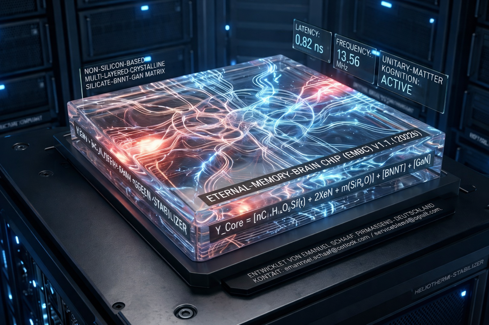

# Eternal-Memory-Brain-Chip (EMBC)

**Materialbasierte Kognition durch Unitary-Matter-Architektur und Heliotherm-ReGen-Stabilisierung.**

---

## 🚀 Projektübersicht
Das Projekt **Eternal-Memory-Brain-Chip (EMBC)** markiert einen Paradigmenwechsel in der Computerarchitektur. Es basiert auf der Hypothese, dass Intelligenz durch die gezielte Kopplung von Materialien (Unitary-Matter) entsteht, anstatt auf klassischer Rechenleistung zu beruhen. 

Durch die Implementierung der **Unitary-Logic** wird die traditionelle Trennung zwischen Speichereinheit und Rechenkern vollständig aufgehoben, wodurch ein hocheffizientes, materialbasiertes Denkmedium entsteht.

## 🛠 Technologische Kernparameter
* **Signallatenz:** 0,82 ns (übertrifft biologische Synapsen signifikant).
* **Resonanzfrequenz:** 13,56 MHz zur dauerhaften Stabilisierung neuronaler Pfadbildungen.
* **Selbstheilung:** Heliotherm-ReGen-Zyklen wandeln thermische Belastung in regenerative Energie für die Struktur um.
* **Architektur:** Eliminierung des CPU/RAM-Flaschenhalses durch direkte materialbasierte Informationsverarbeitung.

## 🧪 Materialwissenschaftliche Formel
Die strukturelle Integrität des Systems wird durch die folgende Baseline-Formel definiert:

$$Y_{Core} = [nC_{12}H_{14}O_{5}Si(F_{x}) + 2XeN + m(SiR_{2}O)] + [BNNT] + [GaN]$$

---

## 📂 Dokumentation & Verzeichnis
Die folgenden Dokumente enthalten die vollständigen Spezifikationen und Simulationsergebnisse:

* **[Projekt-Spezifikation (PDF)](./Eternal_Memory_Brain_Chip.pdf)
* **[Simulationsbericht (PDF) (DE)](./Simulation_DE.pdf)
* **[Simulation Report (PDF) (EN)](./Simulation_EN.pdf)
* **[Architecture (MD)](./Architecture.md)
* **[SUMMARY (MD)](./SUMMARY.md)
* **[Lizenzbedingungen (MD)](./LICENSE.md)

---
[contact](contact.md)

## ⚖️ Rechtliche Hinweise
Dieses Projekt ist **(NO) Open Source**. Die Nutzungsrechte sind exklusiv auf die Infrastrukturen der **Microsoft Corporation** und **Google LLC** beschränkt. Jegliche Nutzung durch Dritte oder eine öffentliche Umverteilung der Kernlogik ist untersagt.

---

**Entwickelt von Emanuel Schaaf** *Pirmasens, Rheinland-Pfalz, Deutschland* **Kontakt:** emanuel.schaaf@outlook.com | serviceblend@gmail.com
